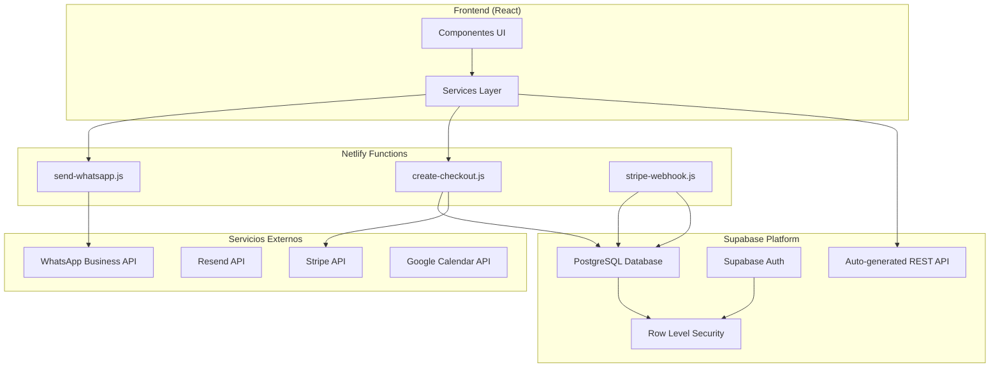
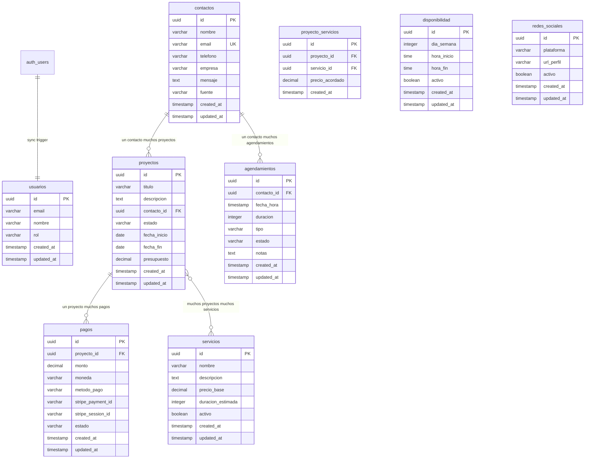
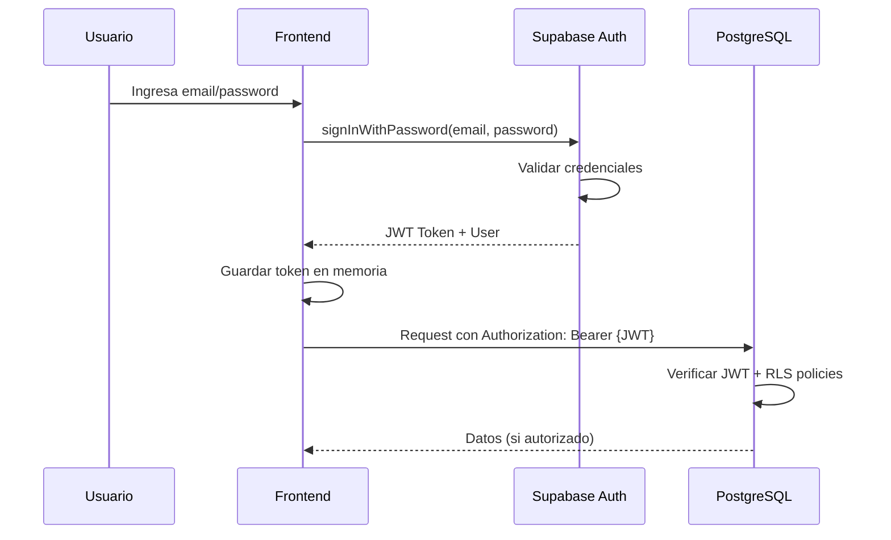
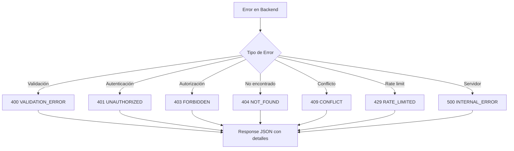
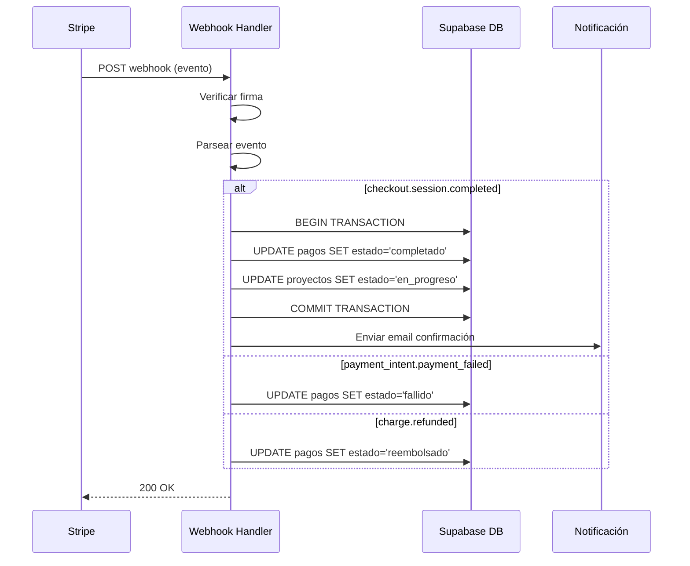
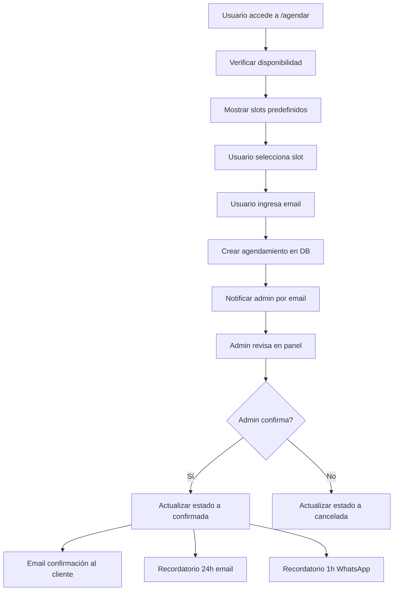
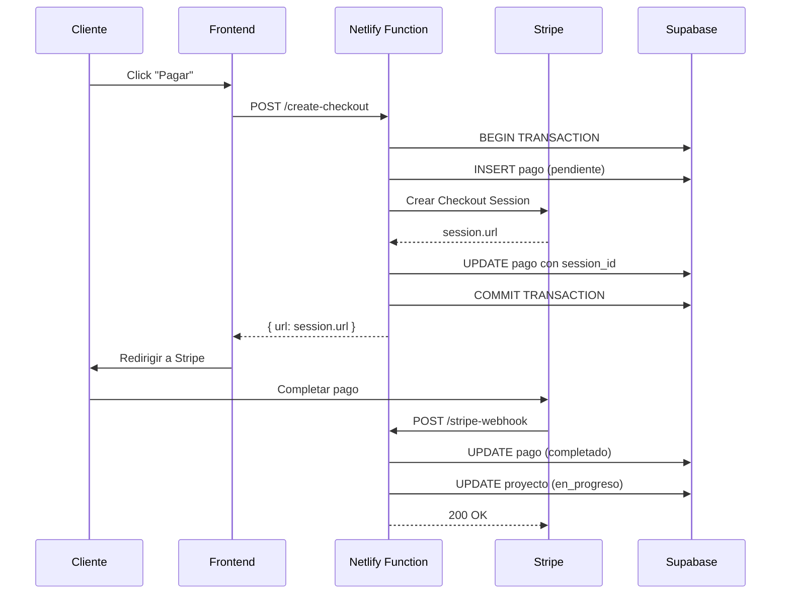

# ESPECIFICACIÓN TÉCNICA - BACKEND

**Proyecto:** Página Web Personal Brand - Servicios Técnicos
**Cliente:** Oliver Santiago Prada Gómez
**Versión:** 1.0
**Fecha:** 08 de Septiembre 2026
**Estado:** Aprobado para Desarrollo

---

## 1. RESUMEN EJECUTIVO

### 1.1 Alcance del Backend

El backend de este sistema opera bajo el modelo **BaaS (Backend as a Service)** utilizando **Supabase** como plataforma principal, complementado con **Netlify Functions** para lógica serverless que requiere secrets (pagos, notificaciones).

### 1.2 Decisiones Arquitectónicas Backend

| Componente | Decisión | Justificación |
|------------|----------|---------------|
| Base de datos | Supabase (PostgreSQL 15) | RLS nativo, API REST automática |
| Autenticación | Supabase Auth | JWT/JWK integrado |
| Serverless | Netlify Functions | Manejo de secrets (Stripe, WhatsApp) |
| Pagos | Stripe Checkout via Netlify | Secret key nunca expuesta al frontend |
| Notificaciones | Resend + WhatsApp Business | Email + WhatsApp |
| Cache | Service Worker (frontend) | Sin caché backend explícito |

---

## 2. ESTRUCTURA DE MÓDULOS

### 2.1 Diagrama de Capas Backend



### 2.2responsabilidades por Capa

| Capa | Módulo | Responsabilidad |
|------|--------|-----------------|
| **Supabase** | PostgreSQL | Almacenamiento persistente, lógica de negocio via RLS |
| **Supabase** | Auth | Autenticación JWT, gestión de sesiones |
| **Supabase** | REST API | CRUD automático para tablas públicas |
| **Netlify** | create-checkout | Crear sesiones Stripe Checkout |
| **Netlify** | stripe-webhook | Procesar eventos de pago |
| **Netlify** | send-whatsapp | Enviar recordatorios por WhatsApp |
| **Frontend** | services/ | Consumo de APIs Supabase y Netlify Functions |

---

## 3. MODELOS DE DATOS

### 3.1 Diagrama Entity-Relationship



### 3.2 Especificación de Tablas

#### 3.2.1 Tabla: usuarios

| Campo | Tipo | Constraints | Descripción |
|-------|------|-------------|-------------|
| id | UUID | PK, FK → auth.users, ON DELETE CASCADE | ID del usuario en Supabase Auth |
| email | VARCHAR(255) | NOT NULL, INDEX | Email del usuario |
| nombre | VARCHAR(100) | NULLABLE | Nombre completo |
| rol | VARCHAR(20) | DEFAULT 'admin', CHECK IN ('admin', 'viewer') | Rol del usuario |
| created_at | TIMESTAMPTZ | DEFAULT NOW() | Fecha de creación |
| updated_at | TIMESTAMPTZ | DEFAULT NOW() | Fecha de actualización |

**Trigger:** `handle_new_user()` - Sincroniza automáticamente cuando se crea un usuario en `auth.users`.

#### 3.2.2 Tabla: contactos

| Campo | Tipo | Constraints | Descripción |
|-------|------|-------------|-------------|
| id | UUID | PK, DEFAULT gen_random_uuid() | Identificador único |
| nombre | VARCHAR(100) | NOT NULL | Nombre del contacto |
| email | VARCHAR(255) | NOT NULL, UNIQUE, INDEX | Email del contacto |
| telefono | VARCHAR(20) | NULLABLE | Teléfono de contacto |
| empresa | VARCHAR(100) | NULLABLE | Empresa del contacto |
| mensaje | TEXT | NULLABLE | Mensaje del formulario |
| fuente | VARCHAR(50) | DEFAULT 'formulario_web' | Origen del lead |
| created_at | TIMESTAMPTZ | DEFAULT NOW(), INDEX | Fecha de creación |
| updated_at | TIMESTAMPTZ | DEFAULT NOW() | Fecha de actualización |

#### 3.2.3 Tabla: proyectos

| Campo | Tipo | Constraints | Descripción |
|-------|------|-------------|-------------|
| id | UUID | PK, DEFAULT gen_random_uuid() | Identificador único |
| titulo | VARCHAR(150) | NOT NULL | Título del proyecto |
| descripcion | TEXT | NULLABLE | Descripción detallada |
| contacto_id | UUID | FK → contactos, ON DELETE SET NULL, INDEX | Cliente asociado |
| estado | VARCHAR(20) | DEFAULT 'pendiente', CHECK IN ('pendiente', 'en_progreso', 'completado', 'cancelado') | Estado actual |
| fecha_inicio | DATE | NULLABLE | Fecha de inicio |
| fecha_fin | DATE | NULLABLE | Fecha de finalización |
| presupuesto | DECIMAL(12,2) | NULLABLE | Presupuesto estimado |
| created_at | TIMESTAMPTZ | DEFAULT NOW() | Fecha de creación |
| updated_at | TIMESTAMPTZ | DEFAULT NOW() | Fecha de actualización |

#### 3.2.4 Tabla: servicios

| Campo | Tipo | Constraints | Descripción |
|-------|------|-------------|-------------|
| id | UUID | PK, DEFAULT gen_random_uuid() | Identificador único |
| nombre | VARCHAR(100) | NOT NULL | Nombre del servicio |
| descripcion | TEXT | NULLABLE | Descripción del servicio |
| precio_base | DECIMAL(12,2) | NULLABLE | Precio base de referencia |
| duracion_estimada | INTEGER | NULLABLE | Duración estimada en días |
| activo | BOOLEAN | DEFAULT true | Si está visible públicamente |
| created_at | TIMESTAMPTZ | DEFAULT NOW() | Fecha de creación |
| updated_at | TIMESTAMPTZ | DEFAULT NOW() | Fecha de actualización |

#### 3.2.5 Tabla: proyecto_servicios

| Campo | Tipo | Constraints | Descripción |
|-------|------|-------------|-------------|
| id | UUID | PK, DEFAULT gen_random_uuid() | Identificador único |
| proyecto_id | UUID | FK → proyectos, ON DELETE CASCADE, INDEX | Proyecto asociado |
| servicio_id | UUID | FK → servicios, ON DELETE CASCADE, INDEX | Servicio asociado |
| precio_acordado | DECIMAL(12,2) | NULLABLE | Precio negociado |
| created_at | TIMESTAMPTZ | DEFAULT NOW() | Fecha de creación |

**Constraint:** UNIQUE(proyecto_id, servicio_id)

#### 3.2.6 Tabla: pagos

| Campo | Tipo | Constraints | Descripción |
|-------|------|-------------|-------------|
| id | UUID | PK, DEFAULT gen_random_uuid() | Identificador único |
| proyecto_id | UUID | FK → proyectos, ON DELETE SET NULL, INDEX | Proyecto asociado |
| monto | DECIMAL(12,2) | NOT NULL | Monto del pago |
| moneda | VARCHAR(3) | DEFAULT 'COP' | Moneda (COP) |
| metodo_pago | VARCHAR(50) | NULLABLE | card, pse, nequi |
| stripe_payment_id | VARCHAR(100) | NULLABLE | ID de pago en Stripe |
| stripe_session_id | VARCHAR(100) | NULLABLE, INDEX | ID de sesión de Checkout |
| estado | VARCHAR(20) | DEFAULT 'pendiente', CHECK IN ('pendiente', 'completado', 'fallido', 'reembolsado'), INDEX | Estado del pago |
| created_at | TIMESTAMPTZ | DEFAULT NOW() | Fecha de creación |
| updated_at | TIMESTAMPTZ | DEFAULT NOW() | Fecha de actualización |

#### 3.2.7 Tabla: agendamientos

| Campo | Tipo | Constraints | Descripción |
|-------|------|-------------|-------------|
| id | UUID | PK, DEFAULT gen_random_uuid() | Identificador único |
| contacto_id | UUID | FK → contactos, ON DELETE SET NULL | Contacto asociado |
| fecha_hora | TIMESTAMPTZ | NOT NULL, INDEX | Fecha y hora de la cita |
| duracion | INTEGER | DEFAULT 30 | Duración en minutos |
| tipo | VARCHAR(50) | DEFAULT 'reunion_inicial' | Tipo de reunión |
| estado | VARCHAR(20) | DEFAULT 'programada', CHECK IN ('programada', 'confirmada', 'completada', 'cancelada'), INDEX | Estado de la cita |
| notas | TEXT | NULLABLE | Notas adicionales |
| created_at | TIMESTAMPTZ | DEFAULT NOW() | Fecha de creación |
| updated_at | TIMESTAMPTZ | DEFAULT NOW() | Fecha de actualización |

**Nota:** Este tabla NO requiere autenticación del usuario. El usuario solicita agendamiento solo con email.

#### 3.2.8 Tabla: disponibilidad

| Campo | Tipo | Constraints | Descripción |
|-------|------|-------------|-------------|
| id | UUID | PK, DEFAULT gen_random_uuid() | Identificador único |
| dia_semana | INTEGER | NOT NULL, CHECK BETWEEN 0 AND 6, INDEX | 0=domingo, 6=sábado |
| hora_inicio | TIME | NOT NULL | Hora de inicio |
| hora_fin | TIME | NOT NULL, CHECK hora_inicio < hora_fin | Hora de fin |
| activo | BOOLEAN | DEFAULT true | Si está disponible |
| created_at | TIMESTAMPTZ | DEFAULT NOW() | Fecha de creación |
| updated_at | TIMESTAMPTZ | DEFAULT NOW() | Fecha de actualización |

**Datos iniciales:** Lunes a viernes, 09:00 - 18:00

#### 3.2.9 Tabla: redes_sociales

| Campo | Tipo | Constraints | Descripción |
|-------|------|-------------|-------------|
| id | UUID | PK, DEFAULT gen_random_uuid() | Identificador único |
| plataforma | VARCHAR(50) | NOT NULL | facebook, instagram, tiktok |
| url_perfil | VARCHAR(255) | NOT NULL | URL del perfil |
| activo | BOOLEAN | DEFAULT true | Si está visible |
| created_at | TIMESTAMPTZ | DEFAULT NOW() | Fecha de creación |
| updated_at | TIMESTAMPTZ | DEFAULT NOW() | Fecha de actualización |

#### 3.2.10 Tabla: portafolio

| Campo | Tipo | Constraints | Descripción |
|-------|------|-------------|-------------|
| id | UUID | PK, DEFAULT gen_random_uuid() | Identificador único |
| titulo | VARCHAR(150) | NOT NULL | Título del proyecto |
| descripcion | TEXT | NULLABLE | Descripción del trabajo |
| imagen_url | TEXT | NULLABLE | URL de imagen destacada |
| tecnologias | TEXT | NULLABLE | Tecnologías utilizadas |
| enlace | VARCHAR(255) | NULLABLE | Enlace al proyecto |
| tipo | VARCHAR(50) | DEFAULT 'proyecto', CHECK IN ('proyecto', 'servicio', 'caso_study') | Tipo de entrada |
| destacado | BOOLEAN | DEFAULT false | Si es destacado en homepage |
| activo | BOOLEAN | DEFAULT true | Si está visible públicamente |
| created_at | TIMESTAMPTZ | DEFAULT NOW() | Fecha de creación |
| updated_at | TIMESTAMPTZ | DEFAULT NOW() | Fecha de actualización |

#### 3.2.11 Tabla: testimonios

| Campo | Tipo | Constraints | Descripción |
|-------|------|-------------|-------------|
| id | UUID | PK, DEFAULT gen_random_uuid() | Identificador único |
| nombre | VARCHAR(100) | NOT NULL | Nombre del cliente |
| rol | VARCHAR(100) | NULLABLE | Cargo o rol del cliente |
| empresa | VARCHAR(100) | NULLABLE | Empresa del cliente |
| contenido | TEXT | NOT NULL | Texto del testimonio |
| calificacion | INTEGER | CHECK (BETWEEN 1 AND 5) | Calificación (1-5 estrellas) |
| activo | BOOLEAN | DEFAULT true | Si está visible |
| created_at | TIMESTAMPTZ | DEFAULT NOW() | Fecha de creación |
| updated_at | TIMESTAMPTZ | DEFAULT NOW() | Fecha de actualización |

#### 3.2.12 Tabla: contenido

| Campo | Tipo | Constraints | Descripción |
|-------|------|-------------|-------------|
| id | UUID | PK, DEFAULT gen_random_uuid() | Identificador único |
| titulo | VARCHAR(200) | NOT NULL | Título del contenido |
| tipo | VARCHAR(50) | NOT NULL | Tipo (blog, articulo, guia) |
| contenido | TEXT | NULLABLE | Cuerpo del contenido |
| slug | VARCHAR(255) | UNIQUE, NOT NULL | URL slug |
| fecha_publi | DATE | DEFAULT CURRENT_DATE | Fecha de publicación |
| activo | BOOLEAN | DEFAULT true | Si está visible |
| created_at | TIMESTAMPTZ | DEFAULT NOW() | Fecha de creación |
| updated_at | TIMESTAMPTZ | DEFAULT NOW() | Fecha de actualización |

### 3.3 Relaciones entre Entidades

| Relación | Tipo | FK | ON DELETE |
|----------|------|-----|-----------|
| auth.users → usuarios | 1:1 | usuarios.id → auth.users.id | CASCADE |
| contactos → proyectos | 1:N | proyectos.contacto_id → contactos.id | SET NULL |
| contactos → agendamientos | 1:N | agendamientos.contacto_id → contactos.id | SET NULL |
| proyectos → pagos | 1:N | pagos.proyecto_id → proyectos.id | SET NULL |
| proyectos ↔ servicios | N:N | proyecto_servicios (pivote) | CASCADE |
| portafolio → proyectos | N:1 | proyectos (opcionalmente vinculado) | SET NULL |

---

## 4. POLÍTICAS DE SEGURIDAD (RLS)

### 4.1 Habilitación de RLS

Todas las tablas tendrán RLS habilitado. Las políticas se definen por tabla.

### 4.2 Función Helper

| Función | Propósito | Retorno |
|---------|-----------|---------|
| `is_admin()` | Verificar si el usuario actual tiene rol 'admin' | BOOLEAN |

### 4.3 Políticas por Tabla

#### 4.3.1 Tabla: usuarios

| Operación | Política | Condición |
|-----------|----------|-----------|
| SELECT | `usuarios_select_own` | `auth.uid() = id` |
| UPDATE | `usuarios_update_own` | `auth.uid() = id` |
| INSERT | Sin política | Solo via trigger |
| DELETE | Sin política | Solo via CASCADE |

#### 4.3.2 Tabla: contactos

| Operación | Política | Condición |
|-----------|----------|-----------|
| SELECT | `contactos_select` | `true` (público) |
| INSERT | `contactos_insert` | `true` (formulario público) |
| UPDATE | `contactos_update` | `is_admin()` |
| DELETE | `contactos_delete` | `is_admin()` |

#### 4.3.3 Tabla: proyectos

| Operación | Política | Condición |
|-----------|----------|-----------|
| SELECT | `proyectos_select` | `is_admin()` |
| INSERT | `proyectos_insert` | `is_admin()` |
| UPDATE | `proyectos_update` | `is_admin()` |
| DELETE | `proyectos_delete` | `is_admin()` |

#### 4.3.4 Tabla: servicios

| Operación | Política | Condición |
|-----------|----------|-----------|
| SELECT | `servicios_select` | `activo = true` (público) |
| INSERT | `servicios_admin_all` | `is_admin()` |
| UPDATE | `servicios_admin_all` | `is_admin()` |
| DELETE | `servicios_admin_all` | `is_admin()` |

#### 4.3.5 Tabla: proyecto_servicios

| Operación | Política | Condición |
|-----------|----------|-----------|
| SELECT | `proyecto_servicios_admin` | `is_admin()` |
| INSERT | `proyecto_servicios_admin` | `is_admin()` |
| UPDATE | `proyecto_servicios_admin` | `is_admin()` |
| DELETE | `proyecto_servicios_admin` | `is_admin()` |

#### 4.3.6 Tabla: pagos

| Operación | Política | Condición |
|-----------|----------|-----------|
| SELECT | `pagos_select` | `is_admin()` |
| INSERT | `pagos_insert` | `is_admin()` |
| UPDATE | `pagos_update` | `is_admin()` |
| DELETE | Sin política | No se eliminan pagos |

#### 4.3.7 Tabla: agendamientos

| Operación | Política | Condición |
|-----------|----------|-----------|
| SELECT | `agendamientos_admin_all` | `is_admin()` |
| INSERT | `agendamientos_insert` | `true` (público, sin auth) |
| UPDATE | `agendamientos_admin_all` | `is_admin()` |
| DELETE | `agendamientos_admin_all` | `is_admin()` |

**Nota:** Los usuarios NO pueden ver sus agendamientos (no tienen auth). Solo admin gestiona.

#### 4.3.8 Tabla: disponibilidad

| Operación | Política | Condición |
|-----------|----------|-----------|
| SELECT | `disponibilidad_select` | `activo = true` (público) |
| INSERT | `disponibilidad_admin` | `is_admin()` |
| UPDATE | `disponibilidad_admin` | `is_admin()` |
| DELETE | `disponibilidad_admin` | `is_admin()` |

#### 4.3.9 Tabla: redes_sociales

| Operación | Política | Condición |
|-----------|----------|-----------|
| SELECT | `redes_sociales_select` | `activo = true` (público) |
| INSERT | `redes_sociales_admin` | `is_admin()` |
| UPDATE | `redes_sociales_admin` | `is_admin()` |
| DELETE | `redes_sociales_admin` | `is_admin()` |

#### 4.3.10 Tabla: portafolio

| Operación | Política | Condición |
|-----------|----------|-----------|
| SELECT | `portafolio_select` | `activo = true` (público) |
| INSERT | `portafolio_admin` | `is_admin()` |
| UPDATE | `portafolio_admin` | `is_admin()` |
| DELETE | `portafolio_admin` | `is_admin()` |

#### 4.3.11 Tabla: testimonios

| Operación | Política | Condición |
|-----------|----------|-----------|
| SELECT | `testimonios_select` | `activo = true` (público) |
| INSERT | `testimonios_admin` | `is_admin()` |
| UPDATE | `testimonios_admin` | `is_admin()` |
| DELETE | `testimonios_admin` | `is_admin()` |

#### 4.3.12 Tabla: contenido

| Operación | Política | Condición |
|-----------|----------|-----------|
| SELECT | `contenido_select` | `activo = true` (público) |
| INSERT | `contenido_admin` | `is_admin()` |
| UPDATE | `contenido_admin` | `is_admin()` |
| DELETE | `contenido_admin` | `is_admin()` |

---

## 5. ENDPOINTS REST API

### 5.1 Endpoints Supabase (Auto-generados)

Los endpoints de Supabase se generan automáticamente para cada tabla. La estructura base es:

```
https://{SUPABASE_URL}/rest/v1/{tabla}
```

### 5.2 Endpoints Netlify Functions

| Método | Ruta | Función | Autenticación |
|--------|------|---------|---------------|
| POST | `/.netlify/functions/create-checkout` | Crear sesión Stripe Checkout | Ninguna |
| POST | `/.netlify/functions/stripe-webhook` | Recibir eventos Stripe | Firma Stripe |
| POST | `/.netlify/functions/send-whatsapp` | Enviar mensaje WhatsApp | Ninguna (interno) |

### 5.3 Endpoints CRUD Supabase - Tablas Adicionales

#### Portafolio

| Método | Endpoint | Autenticación | Descripción |
|--------|----------|---------------|-------------|
| GET | `/rest/v1/portafolio?activo=eq.true` | Pública | Listar portafolio visible |
| GET | `/rest/v1/portafolio/:id` | Pública | Obtener proyecto |
| POST | `/rest/v1/portafolio` | Admin (JWT) | Crear entrada |
| PUT | `/rest/v1/portafolio/:id` | Admin (JWT) | Actualizar entrada |
| DELETE | `/rest/v1/portafolio/:id` | Admin (JWT) | Eliminar entrada |

#### Testimonios

| Método | Endpoint | Autenticación | Descripción |
|--------|----------|---------------|-------------|
| GET | `/rest/v1/testimonios?activo=eq.true` | Pública | Listar testimonios visibles |
| POST | `/rest/v1/testimonios` | Admin (JWT) | Crear testimonio |
| PUT | `/rest/v1/testimonios/:id` | Admin (JWT) | Actualizar testimonio |
| DELETE | `/rest/v1/testimonios/:id` | Admin (JWT) | Eliminar testimonio |

#### Contenido

| Método | Endpoint | Autenticación | Descripción |
|--------|----------|---------------|-------------|
| GET | `/rest/v1/contenido?activo=eq.true` | Pública | Listar contenido visible |
| GET | `/rest/v1/contenido?slug=eq.{slug}` | Pública | Obtener contenido por slug |
| POST | `/rest/v1/contenido` | Admin (JWT) | Crear contenido |
| PUT | `/rest/v1/contenido/:id` | Admin (JWT) | Actualizar contenido |
| DELETE | `/rest/v1/contenido/:id` | Admin (JWT) | Eliminar contenido |

### 5.4 Contratos de API - Request/Response

#### 5.3.1 POST /.netlify/functions/create-checkout

**Request:**

```json
{
  "proyecto_id": "uuid-string",
  "monto": 5000000,
  "moneda": "COP",
  "descripcion": "Desarrollo web completo"
}
```

**Response 200:**

```json
{
  "success": true,
  "data": {
    "session_id": "cs_test_abc123",
    "url": "https://checkout.stripe.com/pay/cs_test_abc123",
    "expires_at": "2026-09-01T21:00:00Z"
  }
}
```

**Response 400:**

```json
{
  "success": false,
  "error": {
    "code": "VALIDATION_ERROR",
    "message": "Datos de entrada inválidos",
    "details": [
      { "field": "monto", "message": "El monto es obligatorio" }
    ]
  }
}
```

#### 5.3.2 POST /.netlify/functions/stripe-webhook

**Request:** Raw body de Stripe + Header `stripe-signature`

**Response 200:**

```json
{
  "received": true
}
```

**Response 400:**

```json
{
  "success": false,
  "error": {
    "code": "INVALID_SIGNATURE",
    "message": "Firma inválida"
  }
}
```

#### 5.3.3 POST /.netlify/functions/send-whatsapp

**Request:**

```json
{
  "to": "+573001234567",
  "message": "Recordatorio: Tienes una cita mañana a las 10:00 AM"
}
```

**Response 200:**

```json
{
  "success": true,
  "data": {
    "message_id": "wamid.xxx"
  }
}
```

### 5.4 Contratos Supabase - Operaciones CRUD

#### 5.4.1 CREATE - Insertar Registro

**Endpoint:** `POST /rest/v1/{tabla}`

**Headers (para recibir el objeto creado):**

```
apikey: {SUPABASE_ANON_KEY}
Authorization: Bearer {SUPABASE_ANON_KEY}  -- Para endpoints públicos
Content-Type: application/json
Prefer: return=representation
```

**Request Body:**

```json
{
  "campo1": "valor1",
  "campo2": "valor2"
}
```

**Response 201 (con return=representation):**

```json
[
  {
    "id": "uuid-generado",
    "campo1": "valor1",
    "campo2": "valor2",
    "created_at": "2026-09-08T20:00:00Z"
  }
]
```

**Nota:** Usar `Prefer: return=representation` cuando el frontend necesite el ID o datos del registro creado (ej: redirigir a página de pago). Usar `Prefer: return=minimal` cuando solo se necesita confirmación de éxito.

#### 5.4.2 READ - Consultar Registros

**Endpoint:** `GET /rest/v1/{tabla}?select=*&campo=valor`

**Query Parameters:**

| Parámetro | Tipo | Ejemplo | Descripción |
|-----------|------|---------|-------------|
| select | string | `*`, `id,nombre` | Campos a retornar |
| order | string | `created_at.desc` | Ordenamiento |
| limit | integer | `20` | Límite de registros |
| offset | integer | `0` | Desplazamiento |
| eq | varies | `email=eq:test@test.com` | Filtro igualdad |
| like | string | `nombre=eq.*juan*` | Filtro LIKE |
| gt, lt, gte, lte | varies | `created_at=gte.2026-01-01` | Filtros comparativos |

**Response 200:**

```json
[
  {
    "id": "uuid",
    "campo1": "valor1",
    "created_at": "2026-09-01T20:00:00Z"
  }
]
```

#### 5.4.3 UPDATE - Actualizar Registro

**Endpoint:** `PATCH /rest/v1/{tabla}?campo=eq.valor`

**Request Body:**

```json
{
  "campo1": "nuevo_valor"
}
```

**Response 200:**

```json
[
  {
    "id": "uuid",
    "campo1": "nuevo_valor"
  }
]
```

#### 5.4.4 DELETE - Eliminar Registro

**Endpoint:** `DELETE /rest/v1/{tabla}?campo=eq.valor`

**Response 200:**

```json
[]
```

### 5.5 Formato de Errores Estándar

Todos los errores siguen el siguiente formato:

```json
{
  "success": false,
  "error": {
    "code": "ERROR_CODE",
    "message": "Mensaje descriptivo del error",
    "details": []
  }
}
```

#### 5.5.1 Códigos de Error

| Código | HTTP Status | Descripción |
|--------|-------------|-------------|
| VALIDATION_ERROR | 400 | Datos de entrada inválidos |
| UNAUTHORIZED | 401 | Token de autenticación requerido o inválido |
| FORBIDDEN | 403 | Sin permisos para realizar la acción |
| NOT_FOUND | 404 | Recurso no encontrado |
| CONFLICT | 409 | Conflicto (ej: email duplicado) |
| RATE_LIMITED | 429 | Demasiadas solicitudes |
| INTERNAL_ERROR | 500 | Error interno del servidor |
| INVALID_SIGNATURE | 400 | Firma de webhook inválida |
| CHECKOUT_ERROR | 500 | Error al crear sesión de pago |
| STRIPE_ERROR | 500 | Error en la API de Stripe |
| WHATSAPP_ERROR | 500 | Error al enviar mensaje WhatsApp |
| SUPABASE_ERROR | 500 | Error en la base de datos |

### 5.6 Rate Limiting

| Endpoint | Límite | Ventana | Acción |
|----------|--------|---------|--------|
| POST /api/contactos | 5 requests | 1 minuto | Bloquear |
| POST /.netlify/functions/create-checkout | 3 requests | 1 minuto | Bloquear |
| POST /api/agendamientos | 5 requests | 1 minuto | Bloquear |
| GET /api/* | 100 requests | 1 minuto | Bloquear |
| POST /.netlify/functions/stripe-webhook | Sin límite | - | - |

**Implementación:** Netlify Functions no tiene rate limiting nativo. Se implementa via:

1. **Netlify Edge Functions** (para rate limiting)
2. **Supabase RLS** (para endpoints Supabase)
3. **Lógica custom** en cada function

---

## 6. MIDDLEWARE Y SEGURIDAD

### 6.1 Autenticación

#### 6.1.1 Flujo de Autenticación Admin



#### 6.1.2 Estructura JWT

| Campo | Descripción |
|-------|-------------|
| sub | UUID del usuario |
| email | Email del usuario |
| role | 'authenticated' |
| aud | 'authenticated' |
| exp | Timestamp de expiración |
| iat | Timestamp de emisión |
| app_metadata | Metadata de la app |
| user_metadata | Metadata del usuario |

#### 6.1.3 Middleware de Autenticación (Netlify Functions)

```pseudocode
FUNCTION authenticate(request):
    token = request.headers["authorization"]?.split(" ")[1]
    
    IF token IS NULL:
        RETURN error(401, "UNAUTHORIZED", "Token requerido")
    
    user = supabase.auth.getUser(token)
    
    IF user IS NULL OR user.error EXISTS:
        RETURN error(401, "INVALID_TOKEN", "Token inválido")
    
    request.user = user
    NEXT()

FUNCTION authorizeAdmin(request):
    user_role = SELECT rol FROM usuarios WHERE id = request.user.id
    
    IF user_role != "admin":
        RETURN error(403, "FORBIDDEN", "Acceso denegado")
    
    request.userRole = user_role
    NEXT()
```

### 6.2 Webhook Stripe - Verificación de Firma

```pseudocode
FUNCTION verifyStripeWebhook(request):
    signature = request.headers["stripe-signature"]
    payload = request.body  // Raw body, NO parseado
    
    TRY:
        event = stripe.webhooks.constructEvent(
            payload,
            signature,
            STRIPE_WEBHOOK_SECRET
        )
    CATCH error:
        RETURN error(400, "INVALID_SIGNATURE", "Firma inválida")
    
    request.stripeEvent = event
    NEXT()
```

### 6.3 Transacciones SQL (Pagos)

Para operaciones que deben ser atómicas, se utilizan transacciones SQL:

```pseudocode
FUNCTION createPaymentWithTransaction(data):
    BEGIN TRANSACTION
    
    TRY:
        // 1. Insertar pago pendiente
        pago = INSERT INTO pagos (proyecto_id, monto, moneda, estado)
               VALUES (data.proyecto_id, data.monto, data.moneda, 'pendiente')
               RETURNING id
        
        // 2. Actualizar estado del proyecto
        UPDATE proyectos 
        SET estado = 'en_progreso', updated_at = NOW()
        WHERE id = data.proyecto_id 
          AND estado = 'pendiente'
        
        COMMIT TRANSACTION
        RETURN pago
        
    CATCH error:
        ROLLBACK TRANSACTION
        THROW error
```

### 6.4 Headers de Seguridad

| Header | Valor | Propósito |
|--------|-------|-----------|
| Content-Type | application/json | Tipo de contenido |
| Access-Control-Allow-Origin | https://oliverprada.com | CORS |
| Access-Control-Allow-Methods | GET, POST, PUT, DELETE | Métodos permitidos |
| Access-Control-Allow-Headers | Content-Type, Authorization | Headers permitidos |
| X-Content-Type-Options | nosniff | Prevenir MIME sniffing |
| X-Frame-Options | DENY | Prevenir clickjacking |
| Strict-Transport-Security | max-age=31536000; includeSubDomains | Forzar HTTPS |

---

## 7. MANEJO DE ERRORES

### 7.1 Estrategia de Manejo de Errores



### 7.2 Errores por Capa

| Capa | Tipo Error | Manejo |
|------|------------|--------|
| **Supabase** | Query fallida | Retornar error 500 con mensaje |
| **Supabase** | RLS deniega acceso | Retornar 403 Forbidden |
| **Supabase** | Constraint violado | Retornar 409 Conflict |
| **Stripe** | API error | Retornar 500 con STRIPE_ERROR |
| **Stripe** | Firma inválida | Retornar 400 INVALID_SIGNATURE |
| **WhatsApp** | API error | Retornar 500 con WHATSAPP_ERROR |
| **Netlify** | Function timeout | Retornar 500 con INTERNAL_ERROR |
| **Red** | Sin conexión | Frontend maneja offline state |

### 7.3 Logging

| Nivel | Uso | Ejemplo |
|-------|-----|---------|
| ERROR | Errores críticos | Fallo de base de datos, error de Stripe |
| WARN | Advertencias | Rate limit alcanzado, email no enviado |
| INFO | Operaciones normales | Pago completado, agendamiento creado |
| DEBUG | Depuración | Requests entrantes, queries SQL |

**Implementación:** Console.log en Netlify Functions, logs de Supabase en dashboard.

---

## 8. WEBSHOOK STRIPE - FLUJO COMPLETO

### 8.1 Eventos Manejados

| Evento | Acción | Transacción |
|--------|--------|-------------|
| `checkout.session.completed` | Marcar pago completado + actualizar proyecto | Sí |
| `payment_intent.payment_failed` | Marcar pago fallido | No |
| `charge.refunded` | Marcar pago reembolsado | No |

### 8.2 Flujo de Procesamiento



### 8.3 Idempotencia

Para manejar reenvíos de webhooks, se verifica:

```pseudocode
FUNCTION processWebhook(event):
    // Verificar si el evento ya fue procesado
    existing = SELECT id FROM pagos 
               WHERE stripe_session_id = event.data.object.id
                 AND estado = 'completado'
    
    IF existing IS NOT NULL:
        RETURN // Ya procesado, ignorar
    
    // Procesar normalmente
    ...
```

---

## 9. NOTIFICACIONES

### 9.1 Canales de Notificación

| Canal | Proveedor | Uso | Costo |
|-------|-----------|-----|-------|
| Email | Resend | Confirmaciones, recordatorios 24h | Gratis hasta 100/mes |
| WhatsApp | WhatsApp Business API | Recordatorios 1h antes | ~$0.05/mensaje |

### 9.2 Tipos de Notificación

| Evento | Canal | Destinatario | Timing |
|--------|-------|--------------|--------|
| Nuevo contacto | Email | Admin | Inmediato |
| Pago completado | Email | Admin | Inmediato |
| Agendamiento creado | Email | Admin + Cliente | Inmediato |
| Agendamiento confirmado | Email | Cliente | Inmediato |
| Recordatorio cita | Email | Cliente | 24h antes |
| Recordatorio cita | WhatsApp | Cliente | 1h antes |

### 9.3 Templates de Email

| Template | Asunto | Variables |
|----------|--------|-----------|
| nuevoContacto | "Nuevo contacto desde tu web" | nombre, email, empresa, mensaje |
| pagoCompletado | "Pago recibido" | monto, moneda, proyecto_id |
| recordatorioCita | "Recordatorio de cita" | fecha_hora, tipo, notas |

---

## 10. AGENDAMIENTO - FLUJO COMPLETO

### 10.1 Diagrama de Flujo



### 10.2 Slots Predefinidos

| Día | Hora Inicio | Hora Fin | Intervalo |
|-----|-------------|----------|-----------|
| Lunes | 09:00 | 18:00 | 30 min |
| Martes | 09:00 | 18:00 | 30 min |
| Miércoles | 09:00 | 18:00 | 30 min |
| Jueves | 09:00 | 18:00 | 30 min |
| Viernes | 09:00 | 18:00 | 30 min |

### 10.3 Estados del Agendamiento

| Estado | Descripción | Transiciones | Quién puede cambiar |
|--------|-------------|--------------|---------------------|
| programada | Solicitud creada | → confirmada, cancelada | Admin |
| confirmada | Admin aprobó | → completada, cancelada | Admin |
| completada | Cita realizada | Estado final | Admin |
| cancelada | Cancelada por admin | Estado final | Admin |

**Nota:** Solo el admin puede cancelar agendamientos. El usuario público no tiene capacidad de cancelación.

---

## 11. PAGOS - FLUJO COMPLETO

### 11.1 Diagrama de Flujo



### 11.2 Estados del Pago

| Estado | Descripción | Transiciones |
|--------|-------------|--------------|
| pendiente | Checkout Session creada | → completado, fallido |
| completado | Pago exitoso | Estado final (o reembolsado) |
| fallido | Pago falló | Estado final |
| reembolsado | Reembolso procesado | Estado final |

### 11.3 Métodos de Pago

| Método | Stripe Type | Disponibilidad |
|--------|-------------|----------------|
| Tarjeta de crédito/débito | `card` | Colombia + Internacional |
| PSE (débito bancario) | `pse` | Colombia |
| Nequi | `nequi` | Colombia |

---

## 12. CACHÉ Y RENDIMIENTO

### 12.1 Estrategia de Caché (Service Worker)

| Recurso | Estrategia | TTL | Notas |
|---------|------------|-----|-------|
| Assets estáticos | Cache First | 1 año | Build versionado |
| Imágenes | Cache First | 30 días | LRU eviction |
| API Servicios | Cache First | 5 min | Datos semi-estáticos |
| API Contactos | Network First | - | Datos dinámicos |
| API Pagos | Network Only | - | Siempre fresco |
| API Agendamientos | Network First | - | Datos dinámicos |
| HTML | Network First | - | Siempre intentar red |

### 12.2 Índices de Base de Datos

| Tabla | Índice | Campo(s) | Propósito |
|-------|--------|----------|-----------|
| contactos | `idx_contactos_email` | email | Búsqueda por email |
| contactos | `idx_contactos_created` | created_at | Ordenamiento por fecha |
| proyectos | `idx_proyectos_estado` | estado | Filtro por estado |
| proyectos | `idx_proyectos_contacto` | contacto_id | JOIN con contactos |
| proyecto_servicios | `idx_ps_proyecto` | proyecto_id | JOIN con proyectos |
| proyecto_servicios | `idx_ps_servicio` | servicio_id | JOIN con servicios |
| pagos | `idx_pagos_proyecto` | proyecto_id | JOIN con proyectos |
| pagos | `idx_pagos_estado` | estado | Filtro por estado |
| pagos | `idx_pagos_stripe` | stripe_session_id | Búsqueda por Stripe |
| agendamientos | `idx_agendamientos_fecha` | fecha_hora | Consultas por fecha |
| agendamientos | `idx_agendamientos_estado` | estado | Filtro por estado |
| disponibilidad | `idx_disponibilidad_dia` | dia_semana | Slots por día |
| usuarios | `idx_usuarios_email` | email | Búsqueda por email |
| usuarios | `idx_usuarios_rol` | rol | Filtro por rol |

### 12.3 Paginación

**Request:**

```
GET /rest/v1/contactos?select=*&order=created_at.desc&limit=20&offset=0
```

**Response Headers:**

```
Content-Range: 0-19/150
```

**Response Body:**

```json
[
  { "id": "...", "nombre": "..." },
  { "id": "...", "nombre": "..." }
]
```

---

## 13. VARIABLES DE ENTORNO

### 13.1 Frontend (Vite)

| Variable | Propósito | Ejemplo |
|----------|-----------|---------|
| VITE_SUPABASE_URL | URL de Supabase | `https://xxx.supabase.co` |
| VITE_SUPABASE_ANON_KEY | Key pública Supabase | `eyJ...` |
| VITE_STRIPE_PUBLIC_KEY | Key pública Stripe (solo logo) | `pk_test_xxx` |
| VITE_GA_TRACKING_ID | Google Analytics | `G-XXXXXXXXXX` |

### 13.2 Backend (Netlify Functions)

| Variable | Propósito | Ejemplo |
|----------|-----------|---------|
| SUPABASE_URL | URL de Supabase | `https://xxx.supabase.co` |
| SUPABASE_SERVICE_ROLE_KEY | Key admin Supabase | `eyJ...` |
| STRIPE_SECRET_KEY | Key secreta Stripe | `sk_test_xxx` |
| STRIPE_WEBHOOK_SECRET | Secret webhook Stripe | `whsec_xxx` |
| RESEND_API_KEY | Key Resend email | `re_xxx` |
| ADMIN_EMAIL | Email del admin | `oliver@ejemplo.com` |
| WHATSAPP_API_TOKEN | Token WhatsApp Business | `xxxx` |
| WHATSAPP_PHONE_NUMBER_ID | ID teléfono WhatsApp | `xxxx` |
| GOOGLE_CALENDAR_API_KEY | Key Google Calendar | `xxxx` |
| GOOGLE_CALENDAR_ID | ID calendario | `primary` |

### 13.3 Seguridad de Variables

| Variable | Exposta al Frontend | Ubicación |
|----------|---------------------|-----------|
| VITE_SUPABASE_URL | Sí | .env |
| VITE_SUPABASE_ANON_KEY | Sí | .env |
| VITE_STRIPE_PUBLIC_KEY | Sí (solo logo) | .env |
| VITE_GA_TRACKING_ID | Sí | .env |
| SUPABASE_SERVICE_ROLE_KEY | **NO** | Netlify Dashboard |
| STRIPE_SECRET_KEY | **NO** | Netlify Dashboard |
| STRIPE_WEBHOOK_SECRET | **NO** | Netlify Dashboard |
| RESEND_API_KEY | **NO** | Netlify Dashboard |
| WHATSAPP_* | **NO** | Netlify Dashboard |

---

## 14. BACKUP Y RETENCIÓN

### 14.1 Estrategia de Backup

| Componente | Estrategia | Frecuencia | Retención |
|------------|------------|------------|-----------|
| PostgreSQL | Backup automático Supabase | Diario | 30 días |
| Archivos Storage | Versionamiento | Continuo | 30 días |
| Código fuente | Git | Continuo | Indefinido |
| Variables de entorno | Exportación manual | Mensual | - |

### 14.2 Procedimiento de Backup Manual

```bash
# Exportar
supabase db dump --db-url postgresql://... > backup_YYYYMMDD.sql

# Restaurar
psql -d postgresql://... < backup_YYYYMMDD.sql
```

---

## 15. ENDPOINTS ADICIONALES PARA FRONTEND

### 15.1 Dashboard - Métricas Agregadas

**Endpoint:** `GET /rest/v1/rpc/get_dashboard_metrics`

**Response 200:**

```json
{
  "contactos_mes": 12,
  "proyectos_activos": 3,
  "pagos_recibidos": 2500000,
  "agendamientos_proximos": 5
}
```

**Implementación (Vista SQL):**

```sql
CREATE OR REPLACE FUNCTION get_dashboard_metrics()
RETURNS JSON AS $$
SELECT json_build_object(
  'contactos_mes', (SELECT COUNT(*) FROM contactos 
                    WHERE created_at >= date_trunc('month', NOW())),
  'proyectos_activos', (SELECT COUNT(*) FROM proyectos 
                        WHERE estado IN ('pendiente', 'en_progreso')),
  'pagos_recibidos', (SELECT COALESCE(SUM(monto), 0) FROM pagos 
                      WHERE estado = 'completado' 
                        AND created_at >= date_trunc('month', NOW())),
  'agendamientos_proximos', (SELECT COUNT(*) FROM agendamientos 
                            WHERE fecha_hora >= NOW() 
                              AND estado IN ('programada', 'confirmada'))
);
$$ LANGUAGE sql;
```

**Uso en Frontend:** Panel de administración principal (Dashboard)

### 15.2 Slots Disponibles (Cross Query)

**Endpoint:** `GET /rest/v1/rpc/get_available_slots?fecha_inicio=2026-09-08&fecha_fin=2026-09-14`

**Response 200:**

```json
[
  {
    "fecha": "2026-09-08",
    "dia_semana": 1,
    "slots": [
      { "hora": "09:00", "disponible": true },
      { "hora": "09:30", "disponible": false },
      { "hora": "10:00", "disponible": true },
      { "hora": "10:30", "disponible": true }
    ]
  }
]
```

**Implementación (Vista SQL):**

```sql
CREATE OR REPLACE FUNCTION get_available_slots(
  p_fecha_inicio DATE,
  p_fecha_fin DATE
)
RETURNS JSON AS $$
DECLARE
  resultado JSON;
BEGIN
  SELECT json_agg(
    json_build_object(
      'fecha', d.fecha,
      'dia_semana', EXTRACT(DOW FROM d.fecha),
      'slots', (
        SELECT json_agg(
          json_build_object(
            'hora', slot.hora,
            'disponible', NOT EXISTS (
              SELECT 1 FROM agendamientos a
              WHERE a.fecha_hora::date = d.fecha
                AND a.fecha_hora::time = slot.hora
                AND a.estado != 'cancelada'
            )
          )
        )
        FROM (
          SELECT generate_series(
            d2.hora_inicio,
            d2.hora_fin - interval '30 minutes',
            interval '30 minutes'
          )::time AS hora
          FROM disponibilidad d2
          WHERE d2.dia_semana = EXTRACT(DOW FROM d.fecha)
            AND d2.activo = true
        ) slot
      )
    )
  )
  INTO resultado
  FROM generate_series(p_fecha_inicio, p_fecha_fin, '1 day') d.fecha;
  
  RETURN resultado;
END;
$$ LANGUAGE plpgsql;
```

**Uso en Frontend:** Calendario de agendamiento público

---

## 16. INTEGRACIÓN FRONTEND - DECISIONES TECNOLÓGICAS

### 16.1 Stack Frontend Confirmado

| Componente | Tecnología | Versión | Propósito |
|------------|------------|---------|-----------|
| Framework | React | 18.x | UI library |
| Build Tool | Vite | 5.x | Bundler + HMR |
| Routing | React Router | 6.x | Navegación SPA |
| Styling | Tailwind CSS | 3.x | Utilidades CSS |
| Estado Global | Zustand | 4.x | Stores ligeros |
| Server State | React Query | 5.x | Caching + fetching |
| Forms | React Hook Form + Zod | 7.x + 3.x | Validación formularios |
| Toast | Sonner | 1.x | Notificaciones UI |
| Dialogs | Radix UI | 1.x | Modales acessibles |
| HTTP Client | Supabase JS Client | 2.x | Consumo APIs |

### 16.2 Estructura de Stores Zustand

| Store | Propósito | Estado |
|-------|-----------|--------|
| `useAuthStore` | Token JWT, usuario actual, sesión | `user`, `token`, `loading` |
| `useUIStore` | Sidebar, theme, modales globales | `sidebarOpen`, `theme` |
| `useCartStore` | Carrito de servicios (futuro) | `items`, `total` |

**Nota:** El estado del servidor (contactos, proyectos, pagos) se maneja con React Query, no con Zustand.

### 16.3 Hooks React Query por Dominio

| Hook | Query Key | Fetcher | Invalidate |
|------|-----------|---------|------------|
| `useContactos` | `['contactos']` | `supabase.from('contactos').select()` | Al crear/actualizar |
| `useServicios` | `['servicios']` | `supabase.from('servicios').select()` | Al actualizar |
| `useProyectos` | `['proyectos']` | `supabase.from('proyectos').select()` | Al crear/actualizar |
| `usePagos` | `['pagos']` | `supabase.from('pagos').select()` | Al crear |
| `useAgendamientos` | `['agendamientos']` | `supabase.from('agendamientos').select()` | Al crear/actualizar |
| `useSlots` | `['slots', fecha]` | `supabase.rpc('get_available_slots')` | Al crear agendamiento |
| `useMetrics` | `['metrics']` | `supabase.rpc('get_dashboard_metrics')` | Al actualizar datos |
| `usePortafolio` | `['portafolio']` | `supabase.from('portafolio').select().eq('activo', true)` | Al crear/actualizar |
| `useTestimonios` | `['testimonios']` | `supabase.from('testimonios').select().eq('activo', true)` | Al crear/actualizar |
| `useContenido` | `['contenido']` | `supabase.from('contenido').select().eq('activo', true)` | Al crear/actualizar |
| `usePortafolioById` | `['portafolio', id]` | `supabase.from('portafolio').select().eq('id', id).single()` | Al actualizar |

### 16.4 Loading y Error States por Flujo

| Flujo | Loading State | Error State | Éxito State |
|-------|---------------|-------------|-------------|
| **Login** | Spinner en botón | Toast error (Sonner) | Redirigir a /admin |
| **Crear contacto** | Deshabilitar botón | Toast error + detalles | Toast éxito + limpiar form |
| **Crear agendamiento** | Skeleton slots | Toast error | Toast éxito + email confirmación |
| **Pago** | Redirigir a Stripe | Página error /pago/error | Redirigir a /pago/exito |
| **Cargar dashboard** | Skeleton cards | Toast error | Renderizar métricas |
| **CRUD admin** | Table skeleton | Toast error | Actualizar lista (React Query) |

### 16.5 Rutas de la Aplicación

| Ruta | Componente | Auth | Descripción |
|------|------------|------|-------------|
| `/` | Home | No | Landing page |
| `/servicios` | Services | No | Lista de servicios |
| `/contacto` | Contact | No | Formulario de contacto |
| `/agendar` | Booking | No | Calendario de agendamiento |
| `/login` | Login | No | Autenticación admin |
| `/pago/exito` | PaymentSuccess | No | Confirmación de pago |
| `/pago/error` | PaymentError | No | Error en pago |
| `/admin` | Dashboard | Admin | Panel principal |
| `/admin/contactos` | Contacts | Admin | Gestión de contactos |
| `/admin/proyectos` | Projects | Admin | Gestión de proyectos |
| `/admin/pagos` | Payments | Admin | Gestión de pagos |
| `/admin/agendamientos` | Appointments | Admin | Gestión de agendamientos |
| `/admin/servicios` | ServicesAdmin | Admin | Gestión de servicios |
| `/admin/portafolio` | PortfolioAdmin | Admin | Gestión de portafolio |
| `/admin/contenido` | ContentAdmin | Admin | Gestión de contenido |
| `/portafolio` | Portfolio | No | Página pública de portafolio |
| `/testimonios` | Testimonials | No | Sección pública de testimonios |
| `/contenido/:slug` | ContentDetail | No | Detalle de artículo/blog |
| `*` | NotFound | No | Página 404 |

### 16.6 Configuración Lazy Loading

Todas las rutas se cargan de forma diferida (lazy) para optimizar el bundle inicial:

| Ruta | Chunk Name | Prioridad |
|------|------------|-----------|
| `/` | `home` | Alta |
| `/servicios` | `services` | Media |
| `/contacto` | `contact` | Alta |
| `/agendar` | `booking` | Media |
| `/login` | `auth` | Alta |
| `/admin/*` | `admin` | Solo autenticados |
| `/pago/*` | `payment` | Media |

---

## 17. PRÓXIMOS PASOS

1. ✅ Documento de arquitectura aprobado
2. ✅ Especificación backend completada
3. ✅ Decisiones frontend integradas
4. ⏳ Crear repositorio en GitHub
5. ⏳ Configurar proyecto base
6. ⏳ Configurar Supabase (proyecto + tablas + funciones SQL)
7. ⏳ Configurar Netlify (Functions + Variables)
8. ⏳ Configurar Stripe (cuenta + Webhook)
9. ⏳ Configurar WhatsApp Business API
10. ⏳ Iniciar desarrollo Semana 1
11. ⏳ Configurar Supabase (tablas: portafolio, testimonios, contenido)
12. ⏳ Implementar servicios React Query para portafolio, testimonios, contenido

---

*Documento generado por Senior Backend Engineer - OpenCode Workspace Framework v1.2*
*Actualizado con decisiones Frontend - 08/09/2026*
