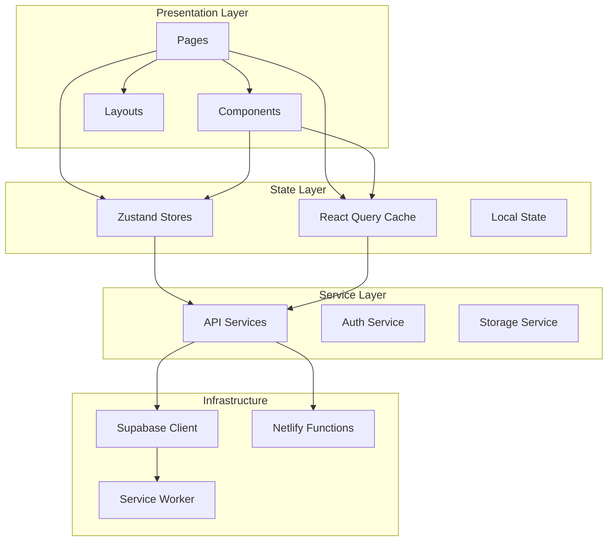
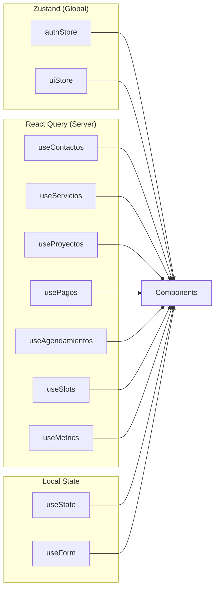
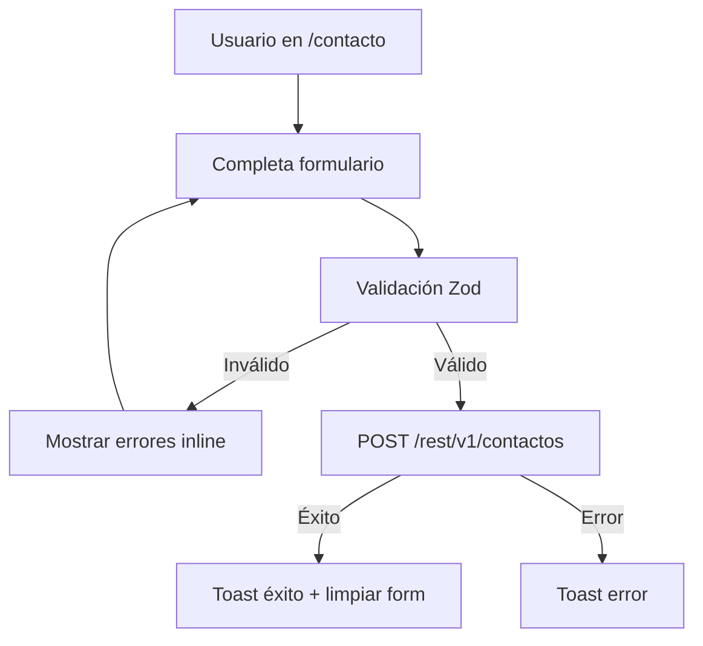
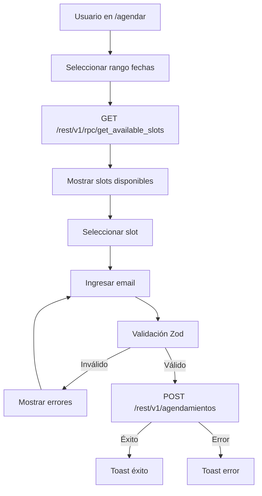
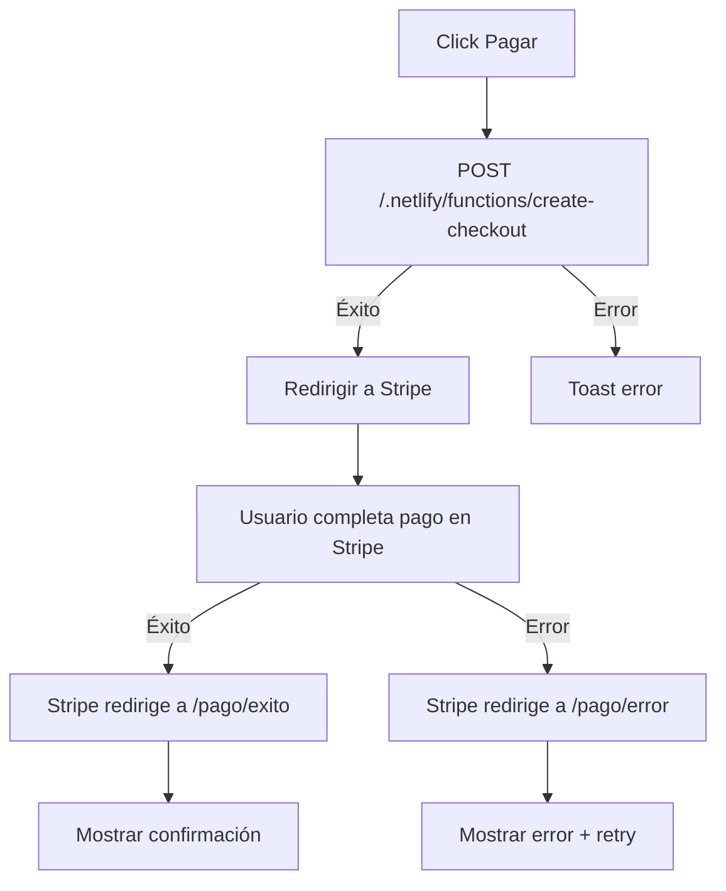
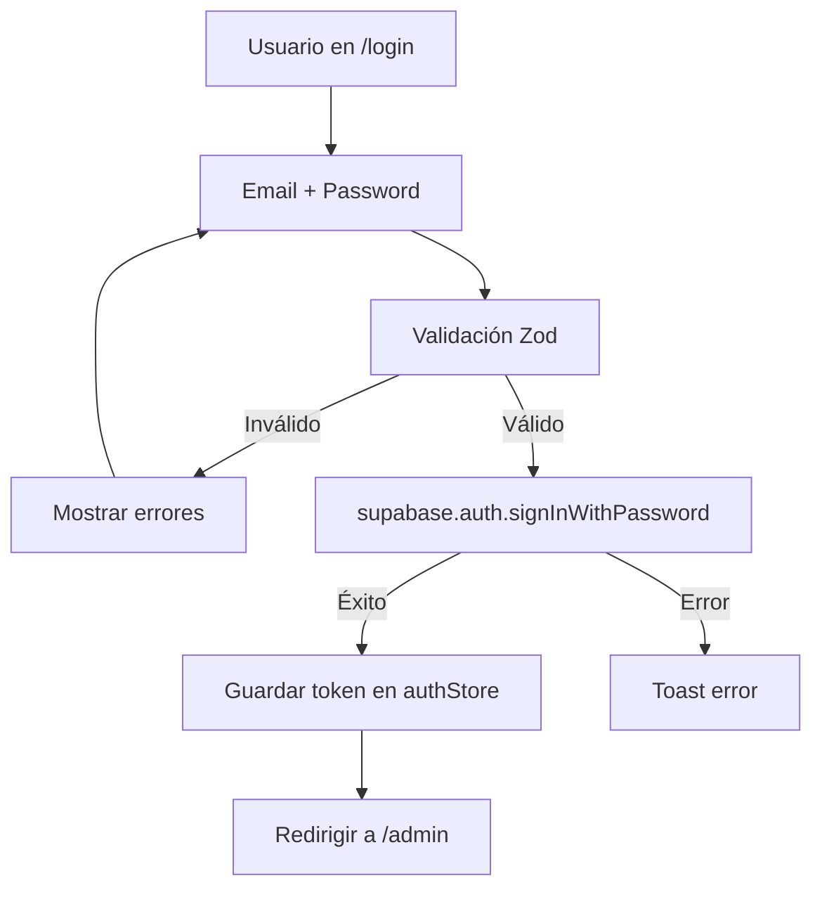
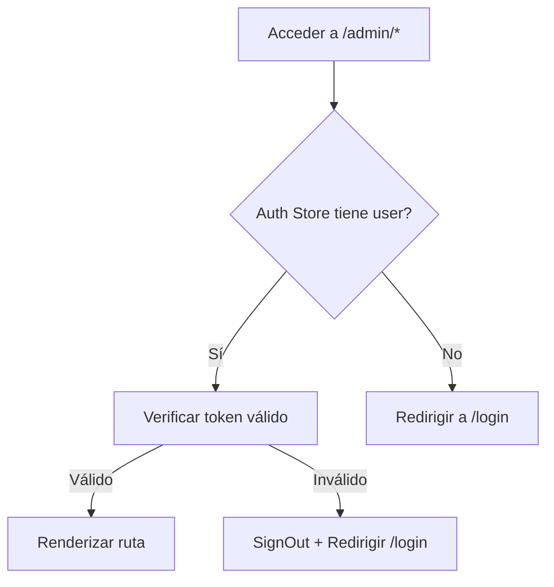

# ESPECIFICACIÓN TÉCNICA - FRONTEND

**Proyecto:** Página Web Personal Brand - Servicios Técnicos
**Cliente:** Oliver Santiago Prada Gómez
**Versión:** 1.0
**Fecha:** 08 de Septiembre 2026
**Estado:** Aprobado para Desarrollo

---

## 1. RESUMEN EJECUTIVO

### 1.1 Alcance del Frontend

El frontend es una **Progressive Web App (PWA)** construida con **React 18 + Vite**, que opera como **SPA (Single Page Application)** sin SSR/SSG. El sistema implementa una presencia en línea profesional tipo Personal Brand con funcionalidades de conversión (formularios, agendamiento, pagos).

### 1.2 Decisiones Arquitectónicas Frontend

| Componente | Decisión | Justificación |
|------------|----------|---------------|
| Framework | React 18 SPA | Especificado en BRIEF |
| Build | Vite 5 | HMR rápido, PWA nativo |
| Routing | React Router 6 | Navegación SPA lazy |
| Estado Global | Zustand | Stores ligeros (auth, UI) |
| Server State | React Query 5 | Caching, fetching, invalidación |
| Forms | React Hook Form + Zod | Validación declarativa |
| Styling | Tailwind CSS 3 | Utilidades + custom config |
| Toast | Sonner | Notificaciones no intrusivas |
| Dialogs | Radix UI | Modales acessibles |
| HTTP | Supabase JS Client | Consumo APIs nativo |

---

## 2. ARQUITECTURA DE COMPONENTES

### 2.1 Diagrama de Capas



### 2.2 Estructura de Directorios

```
src/
├── app/
│   ├── App.jsx                    # Root component + providers
│   └── routes.jsx                 # Route definitions (lazy)
├── components/
│   ├── ui/                        # Primitive UI components
│   │   ├── Button.jsx
│   │   ├── Input.jsx
│   │   ├── Card.jsx
│   │   ├── Modal.jsx
│   │   ├── Toast.jsx
│   │   ├── Skeleton.jsx
│   │   └── Badge.jsx
│   ├── layout/
│   │   ├── PublicLayout.jsx       # Header + Footer
│   │   ├── AdminLayout.jsx       # Sidebar + Header + Content
│   │   └── AuthLayout.jsx        # Centered card
│   ├── forms/
│   │   ├── ContactForm.jsx
│   │   ├── BookingForm.jsx
│   │   ├── LoginForm.jsx
│   │   └── ServiceForm.jsx
│   └── sections/
│       ├── Hero.jsx
│       ├── ServicesGrid.jsx
│       ├── Portfolio.jsx
│       └── SocialLinks.jsx
├── pages/
│   ├── public/
│   │   ├── Home.jsx
│   │   ├── Services.jsx
│   │   ├── Contact.jsx
│   │   ├── Booking.jsx
│   │   └── NotFound.jsx
│   ├── auth/
│   │   └── Login.jsx
│   ├── payment/
│   │   ├── PaymentSuccess.jsx
│   │   └── PaymentError.jsx
│   └── admin/
│       ├── Dashboard.jsx
│       ├── Contacts.jsx
│       ├── Projects.jsx
│       ├── Payments.jsx
│       ├── Appointments.jsx
│       └── ServicesAdmin.jsx
├── hooks/
│   ├── useAuth.js                 # Auth state (Supabase)
│   ├── useContactos.js            # React Query contacts
│   ├── useServicios.js            # React Query services
│   ├── useProyectos.js            # React Query projects
│   ├── usePagos.js                # React Query payments
│   ├── useAgendamientos.js        # React Query appointments
│   ├── useSlots.js                # React Query available slots
│   └── useMetrics.js              # React Query dashboard metrics
├── stores/
│   ├── authStore.js               # Zustand: user, token
│   └── uiStore.js                 # Zustand: sidebar, theme
├── services/
│   ├── supabase.js                # Supabase client init
│   ├── contactService.js          # Contact CRUD
│   ├── serviceService.js          # Services CRUD
│   ├── projectService.js          # Projects CRUD
│   ├── paymentService.js          # Payment + Checkout
│   ├── appointmentService.js      # Appointments CRUD
│   ├── portfolioService.js        # Portfolio CRUD
│   ├── testimonialService.js      # Testimonials CRUD
│   ├── contentService.js          # Content/blog CRUD
│   └── metricsService.js          # Dashboard metrics
├── lib/
│   ├── constants.js               # App constants
│   ├── validators.js              # Zod schemas
│   └── formatters.js              # Date, currency formatters
├── styles/
│   └── globals.css                # Tailwind imports + custom
├── main.jsx                       # Entry point
└── index.html                     # HTML template
```

---

## 3. MAPA DE RUTAS

### 3.1 Árbol de Rutas

```
/ (PublicLayout)
├── / (Home)
├── /servicios (Services)
├── /portafolio (Portfolio)
├── /testimonios (Testimonials)
├── /contacto (Contact)
├── /agendar (Booking)
├── /contenido/:slug (ContentDetail)
├── /pago/exito (PaymentSuccess)
├── /pago/error (PaymentError)
└── * (NotFound)

/login (AuthLayout)
└── /login (Login)

/admin (AdminLayout - Protected)
├── /admin (Dashboard)
├── /admin/contactos (Contacts)
├── /admin/proyectos (Projects)
├── /admin/pagos (Payments)
├── /admin/agendamientos (Appointments)
├── /admin/servicios (ServicesAdmin)
├── /admin/portafolio (PortfolioAdmin)
├── /admin/contenido (ContentAdmin)
└── * (NotFound)
```

### 3.2 Tabla de Rutas

| Ruta | Componente | Layout | Auth | Lazy | Descripción |
|------|------------|--------|------|------|-------------|
| `/` | Home | Public | No | Sí | Landing page principal |
| `/servicios` | Services | Public | No | Sí | Catálogo de servicios |
| `/portafolio` | Portfolio | Public | No | Sí | Portafolio de proyectos |
| `/testimonios` | Testimonials | Public | No | Sí | Sección de testimonios |
| `/contacto` | Contact | Public | No | Sí | Formulario de contacto |
| `/agendar` | Booking | Public | No | Sí | Calendario de agendamiento |
| `/contenido/:slug` | ContentDetail | Public | No | Sí | Detalle de artículo/blog |
| `/pago/exito` | PaymentSuccess | Public | No | Sí | Confirmación de pago |
| `/pago/error` | PaymentError | Public | No | Sí | Error en pago |
| `/login` | Login | Auth | No | Sí | Autenticación admin |
| `/admin` | Dashboard | Admin | Admin | Sí | Panel principal |
| `/admin/contactos` | Contacts | Admin | Admin | Sí | Gestión de contactos |
| `/admin/proyectos` | Projects | Admin | Admin | Sí | Gestión de proyectos |
| `/admin/pagos` | Payments | Admin | Admin | Sí | Gestión de pagos |
| `/admin/agendamientos` | Appointments | Admin | Admin | Sí | Gestión de agendamientos |
| `/admin/servicios` | ServicesAdmin | Admin | Admin | Sí | Gestión de servicios |
| `/admin/portafolio` | PortfolioAdmin | Admin | Admin | Sí | Gestión de portafolio |
| `/admin/contenido` | ContentAdmin | Admin | Admin | Sí | Gestión de contenido |
| `*` | NotFound | Public | No | Sí | Página 404 |

### 3.3 Configuración Lazy Loading

Cada página se carga bajo demanda usando `React.lazy()`:

| Chunk | Rutas | Tamaño Estimado |
|-------|-------|-----------------|
| `home` | `/` | ~15 KB |
| `services` | `/servicios` | ~12 KB |
| `portfolio` | `/portafolio` | ~14 KB |
| `testimonials` | `/testimonios` | ~8 KB |
| `content` | `/contenido/:slug` | ~10 KB |
| `contact` | `/contacto` | ~10 KB |
| `booking` | `/agendar` | ~18 KB |
| `auth` | `/login` | ~8 KB |
| `payment` | `/pago/*` | ~10 KB |
| `admin` | `/admin/*` | ~55 KB |
| `notfound` | `*` | ~3 KB |

---

## 4. GESTIÓN DE ESTADO

### 4.1 Diagrama de Flujos de Estado



### 4.2 Zustand Stores

#### 4.2.1 authStore

| Campo | Tipo | Descripción |
|-------|------|-------------|
| `user` | Object | Usuario actual de Supabase Auth |
| `token` | String | JWT token de sesión |
| `loading` | Boolean | Estado de carga inicial |
| `signIn` | Function | Iniciar sesión |
| `signOut` | Function | Cerrar sesión |
| `initialize` | Function | Verificar sesión existente |

#### 4.2.2 uiStore

| Campo | Tipo | Descripción |
|-------|------|-------------|
| `sidebarOpen` | Boolean | Estado del sidebar admin |
| `theme` | String | 'light' o 'dark' |
| `toggleSidebar` | Function | Abrir/cerrar sidebar |
| `setTheme` | Function | Cambiar tema |

### 4.3 React Query Configuration

| Configuración | Valor | Propósito |
|---------------|-------|-----------|
| `staleTime` | 5 min | Datos frescos por 5 min |
| `cacheTime` | 30 min | Mantener en caché 30 min |
| `retry` | 2 | Reintentar 2 veces en error |
| `refetchOnWindowFocus` | false | No refrescar al cambiar foco |

### 4.4 Hooks React Query

#### 4.4.1 useContactos

| Propiedad | Descripción |
|-----------|-------------|
| Query Key | `['contactos']` |
| Fetcher | `supabase.from('contactos').select('*')` |
| Invalidate | Al crear, actualizar o eliminar contacto |
| Mutations | `useCreateContacto`, `useUpdateContacto`, `useDeleteContacto` |

#### 4.4.2 useServicios

| Propiedad | Descripción |
|-----------|-------------|
| Query Key | `['servicios']` |
| Fetcher | `supabase.from('servicios').select('*').eq('activo', true)` |
| Invalidate | Al actualizar servicio |
| Mutations | `useUpdateServicio` (admin) |

#### 4.4.3 useProyectos

| Propiedad | Descripción |
|-----------|-------------|
| Query Key | `['proyectos']` |
| Fetcher | `supabase.from('proyectos').select('*')` |
| Invalidate | Al crear, actualizar o eliminar proyecto |
| Mutations | `useCreateProyecto`, `useUpdateProyecto`, `useDeleteProyecto` |

#### 4.4.4 usePagos

| Propiedad | Descripción |
|-----------|-------------|
| Query Key | `['pagos']` |
| Fetcher | `supabase.from('pagos').select('*')` |
| Invalidate | Al crear pago |
| Mutations | `useCreatePago` |

#### 4.4.5 useAgendamientos

| Propiedad | Descripción |
|-----------|-------------|
| Query Key | `['agendamientos']` |
| Fetcher | `supabase.from('agendamientos').select('*')` |
| Invalidate | Al crear, actualizar o eliminar agendamiento |
| Mutations | `useCreateAgendamiento`, `useUpdateAgendamiento`, `useDeleteAgendamiento` |

#### 4.4.6 useSlots

| Propiedad | Descripción |
|-----------|-------------|
| Query Key | `['slots', fechaInicio, fechaFin]` |
| Fetcher | `supabase.rpc('get_available_slots', { fecha_inicio, fecha_fin })` |
| Invalidate | Al crear agendamiento |

#### 4.4.7 useMetrics

| Propiedad | Descripción |
|-----------|-------------|
| Query Key | `['metrics']` |
| Fetcher | `supabase.rpc('get_dashboard_metrics')` |
| Invalidate | Al actualizar contactos, proyectos o pagos |

#### 4.4.8 usePortafolio

| Propiedad | Descripción |
|-----------|-------------|
| Query Key | `['portafolio']` |
| Fetcher | `supabase.from('portafolio').select('*').eq('activo', true)` |
| Invalidate | Al crear, actualizar o eliminar portafolio |
| Mutations | `useCreatePortafolio`, `useUpdatePortafolio`, `useDeletePortafolio` |

#### 4.4.9 useTestimonios

| Propiedad | Descripción |
|-----------|-------------|
| Query Key | `['testimonios']` |
| Fetcher | `supabase.from('testimonios').select('*').eq('activo', true)` |
| Invalidate | Al crear, actualizar o eliminar testimonios |
| Mutations | `useCreateTestimonio`, `useUpdateTestimonio`, `useDeleteTestimonio` |

#### 4.4.10 useContenido

| Propiedad | Descripción |
|-----------|-------------|
| Query Key | `['contenido']` |
| Fetcher | `supabase.from('contenido').select('*').eq('activo', true)` |
| Invalidate | Al crear, actualizar o eliminar contenido |
| Mutations | `useCreateContenido`, `useUpdateContenido`, `useDeleteContenido` |

---

## 5. COMPONENTES UI

### 5.1 Sistema de Diseño

#### 5.1.1 Paleta de Colores

| Token | Valor | Uso |
|-------|-------|-----|
| `primary-500` | #3b82f6 | Botones principales, links |
| `primary-800` | #1e40af | Hover states |
| `dark-900` | #000000 | Fondos principales |
| `dark-800` | #1e293b | Fondos secundarios |
| `gray-100` | #f1f5f9 | Fondos claros |
| `white` | #ffffff | Texto en fondos oscuros |
| `success` | #22c55e | Estados exitosos |
| `warning` | #f59e0b | Advertencias |
| `error` | #ef4444 | Errores |

#### 5.1.2 Tipografía

| Elemento | Font | Size | Weight |
|----------|------|------|--------|
| H1 | Inter | 36px | 700 |
| H2 | Inter | 30px | 600 |
| H3 | Inter | 24px | 600 |
| Body | Inter | 16px | 400 |
| Small | Inter | 14px | 400 |
| Caption | Inter | 12px | 400 |

### 5.2 Componentes Primitivos

| Componente | Props | Descripción |
|------------|-------|-------------|
| `Button` | `variant`, `size`, `loading`, `disabled`, `onClick` | Botón con variantes (primary, secondary, ghost, danger) |
| `Input` | `label`, `error`, `type`, `placeholder`, `register` | Campo de entrada con label y error |
| `TextArea` | `label`, `error`, `rows`, `register` | Campo de texto multilinea |
| `Select` | `label`, `error`, `options`, `register` | Selector desplegable |
| `Card` | `children`, `className` | Contenedor con borde y sombra |
| `Badge` | `variant`, `children` | Etiqueta de estado |
| `Skeleton` | `width`, `height`, `lines` | Indicador de carga |
| `Modal` | `open`, `onClose`, `title`, `children` | Diálogo modal (Radix) |
| `Toast` | Configurada globalmente con Sonner | Notificaciones |

### 5.3 Componentes de Formulario

| Componente | Validación | Campos |
|------------|------------|--------|
| `ContactForm` | Zod schema | nombre*, email*, telefono, empresa, mensaje* |
| `BookingForm` | Zod schema | fecha_hora*, duracion, tipo, notas |
| `LoginForm` | Zod schema | email*, password* |
| `ServiceForm` | Zod schema (admin) | nombre*, descripcion, precio_base, duracion_estimada |

### 5.4 Componentes de Sección (Landing)

| Componente | Props | Descripción |
|------------|-------|-------------|
| `Hero` | `title`, `subtitle`, `ctaText`, `ctaLink` | Sección principal hero |
| `ServicesGrid` | `services[]` | Grid de servicios (fetch de API) |
| `Portfolio` | `items[]` | Grid de portafolio con filtros |
| `PortfolioCard` | `item` | Tarjeta individual de proyecto |
| `Testimonials` | `testimonials[]` | Carrusel de testimonios |
| `ContentSection` | `items[]` | Lista de artículos/blog |
| `ContentCard` | `item` | Tarjeta de artículo/blog |
| `SocialLinks` | `links[]` | Redes sociales (fetch de API) |

---

## 6. SERVICIOS API

### 6.1 Inicialización Supabase

| Configuración | Variable | Fuente |
|---------------|----------|--------|
| URL | `VITE_SUPABASE_URL` | .env |
| Anon Key | `VITE_SUPABASE_ANON_KEY` | .env |

### 6.2 Servicio de Contactos

| Método | Parámetros | Retorno | Query Supabase |
|--------|------------|---------|----------------|
| `getContactos()` | `page`, `limit` | `{ data, error, count }` | `.from('contactos').select('*')` |
| `getContactoById(id)` | `id: UUID` | `{ data, error }` | `.from('contactos').select('*').eq('id', id).single()` |
| `createContacto(data)` | `ContactoInput` | `{ data, error }` | `.from('contactos').insert(data).select()` |
| `updateContacto(id, data)` | `id, ContactoInput` | `{ data, error }` | `.from('contactos').update(data).eq('id', id).select()` |
| `deleteContacto(id)` | `id: UUID` | `{ error }` | `.from('contactos').delete().eq('id', id)` |

### 6.3 Servicio de Servicios

| Método | Parámetros | Retorno | Query Supabase |
|--------|------------|---------|----------------|
| `getServicios()` | - | `{ data, error }` | `.from('servicios').select('*').eq('activo', true)` |
| `getServicioById(id)` | `id: UUID` | `{ data, error }` | `.from('servicios').select('*').eq('id', id).single()` |
| `updateServicio(id, data)` | `id, ServicioInput` | `{ data, error }` | `.from('servicios').update(data).eq('id', id).select()` |

### 6.4 Servicio de Proyectos

| Método | Parámetros | Retorno | Query Supabase |
|--------|------------|---------|----------------|
| `getProyectos()` | `page`, `limit`, `estado` | `{ data, error, count }` | `.from('proyectos').select('*')` |
| `getProyectoById(id)` | `id: UUID` | `{ data, error }` | `.from('proyectos').select('*').eq('id', id).single()` |
| `createProyecto(data)` | `ProyectoInput` | `{ data, error }` | `.from('proyectos').insert(data).select()` |
| `updateProyecto(id, data)` | `id, ProyectoInput` | `{ data, error }` | `.from('proyectos').update(data).eq('id', id).select()` |
| `deleteProyecto(id)` | `id: UUID` | `{ error }` | `.from('proyectos').delete().eq('id', id)` |

### 6.5 Servicio de Pagos

| Método | Parámetros | Retorno | Query Supabase |
|--------|------------|---------|----------------|
| `getPagos()` | `page`, `limit` | `{ data, error, count }` | `.from('pagos').select('*')` |
| `getPagoById(id)` | `id: UUID` | `{ data, error }` | `.from('pagos').select('*').eq('id', id).single()` |
| `createPago(data)` | `PagoInput` | `{ data, error }` | `POST /.netlify/functions/create-checkout` |

### 6.6 Servicio de Agendamientos

| Método | Parámetros | Retorno | Query Supabase |
|--------|------------|---------|----------------|
| `getAgendamientos()` | `page`, `limit`, `fecha` | `{ data, error, count }` | `.from('agendamientos').select('*')` |
| `getSlotsDisponibles(fechaInicio, fechaFin)` | `dates` | `{ data, error }` | `.rpc('get_available_slots', { ... })` |
| `createAgendamiento(data)` | `AgendamientoInput` | `{ data, error }` | `.from('agendamientos').insert(data).select()` |
| `updateAgendamiento(id, data)` | `id, AgendamientoInput` | `{ data, error }` | `.from('agendamientos').update(data).eq('id', id).select()` |
| `deleteAgendamiento(id)` | `id: UUID` | `{ error }` | `.from('agendamientos').delete().eq('id', id)` |

### 6.7 Servicio de Métricas

| Método | Parámetros | Retorno | Query Supabase |
|--------|------------|---------|----------------|
| `getDashboardMetrics()` | - | `{ data, error }` | `.rpc('get_dashboard_metrics')` |

### 6.8 Servicio de Portafolio

| Método | Parámetros | Retorno | Query Supabase |
|--------|------------|---------|----------------|
| `getPortafolio()` | - | `{ data, error }` | `.from('portafolio').select('*').eq('activo', true)` |
| `getPortafolioById(id)` | `id: UUID` | `{ data, error }` | `.from('portafolio').select('*').eq('id', id).single()` |
| `createPortafolio(data)` | `PortafolioInput` | `{ data, error }` | `.from('portafolio').insert(data).select()` |
| `updatePortafolio(id, data)` | `id, PortafolioInput` | `{ data, error }` | `.from('portafolio').update(data).eq('id', id).select()` |
| `deletePortafolio(id)` | `id: UUID` | `{ error }` | `.from('portafolio').delete().eq('id', id)` |

### 6.9 Servicio de Testimonios

| Método | Parámetros | Retorno | Query Supabase |
|--------|------------|---------|----------------|
| `getTestimonios()` | - | `{ data, error }` | `.from('testimonios').select('*').eq('activo', true)` |
| `createTestimonio(data)` | `TestimonioInput` | `{ data, error }` | `.from('testimonios').insert(data).select()` |
| `updateTestimonio(id, data)` | `id, TestimonioInput` | `{ data, error }` | `.from('testimonios').update(data).eq('id', id).select()` |
| `deleteTestimonio(id)` | `id: UUID` | `{ error }` | `.from('testimonios').delete().eq('id', id)` |

### 6.10 Servicio de Contenido

| Método | Parámetros | Retorno | Query Supabase |
|--------|------------|---------|----------------|
| `getContenido()` | - | `{ data, error }` | `.from('contenido').select('*').eq('activo', true)` |
| `getContenidoBySlug(slug)` | `slug: string` | `{ data, error }` | `.from('contenido').select('*').eq('slug', slug).single()` |
| `createContenido(data)` | `ContenidoInput` | `{ data, error }` | `.from('contenido').insert(data).select()` |
| `updateContenido(id, data)` | `id, ContenidoInput` | `{ data, error }` | `.from('contenido').update(data).eq('id', id).select()` |
| `deleteContenido(id)` | `id: UUID` | `{ error }` | `.from('contenido').delete().eq('id', id)` |

---

## 7. MANEJO DE UI/UX

### 7.1 Estados de Carga

| Componente | Estado | Componente UI |
|------------|--------|---------------|
| Dashboard | Cargando | Skeleton cards (4 items) |
| Tabla admin | Cargando | Skeleton table rows (5 items) |
| Formulario | Enviando | Button spinner + disabled |
| Calendario | Cargando | Skeleton calendar grid |
| Página completa | Cargando | Full page spinner |
| Portafolio | Cargando | Grid skeleton (4 items) |
| Testimonios | Cargando | Carousel skeleton |
| Contenido | Cargando | List skeleton (3 items) |

### 7.2 Estados de Error

| Tipo Error | Componente UI | Acción |
|------------|---------------|--------|
| Error de red | Toast error (Sonner) | Retry automático 2 veces |
| Error de validación | Inline errors en formulario | Mostrar mensaje por campo |
| Error 401 | Redirigir a `/login` | Limpiar auth store |
| Error 403 | Toast "Acceso denegado" | Redirigir a home |
| Error 404 | Página NotFound | Mostrar 404 custom |
| Error 500 | Toast "Error del servidor" | Log en consola |

### 7.3 Toast Notifications (Sonner)

| Evento | Tipo | Mensaje | Duración |
|--------|------|---------|----------|
| Contacto creado | Success | "Mensaje enviado correctamente" | 3s |
| Agendamiento creado | Success | "Solicitud de cita enviada" | 3s |
| Pago iniciado | Info | "Redirigiendo a Stripe..." | - |
| Pago exitoso | Success | "Pago completado" | 5s |
| Login exitoso | Success | "Bienvenido al panel" | 3s |
| Error de API | Error | "Error al cargar datos" | 5s |
| Rate limit | Warning | "Demasiadas solicitudes" | 4s |
| Portafolio creado | Success | "Proyecto agregado al portafolio" | 3s |
| Testimonio creado | Success | "Testimonio guardado" | 3s |
| Contenido publicado | Success | "Contenido publicado" | 3s |

### 7.4 Modales (Radix UI)

| Modal | Trigger | Contenido | Acciones |
|-------|---------|-----------|----------|
| Confirmar eliminación | Botón eliminar | "¿Estás seguro?" | Confirmar / Cancelar |
| Ver detalle | Click en fila | Detalles del registro | Cerrar |
| Editar | Botón editar | Formulario de edición | Guardar / Cancelar |

### 7.5 Skeletons por Página

| Página | Skeleton |
|--------|----------|
| Dashboard | 4 cards de métricas + tabla skeleton |
| Contactos | Tabla skeleton (5 rows) |
| Proyectos | Tabla skeleton (5 rows) + filtros skeleton |
| Pagos | Tabla skeleton (5 rows) |
| Agendamientos | Calendario skeleton o tabla skeleton |
| Servicios | Grid skeleton (4 items) |
| Portafolio | Grid skeleton (4 items) |
| Contenido | List skeleton (3 items) |

---

## 8. CACHÉ Y RENDIMIENTO

### 8.1 Estrategia de Caché (Service Worker)

| Recurso | Estrategia | TTL | Implementación |
|---------|------------|-----|----------------|
| Assets JS/CSS | Cache First | 1 año | Workbox (Vite PWA) |
| Imágenes | Cache First | 30 días | Workbox |
| API Servicios | Cache First | 5 min | React Query `staleTime` |
| API Contactos | Network First | - | React Query default |
| API Pagos | Network Only | - | React Query `staleTime: 0` |
| API Agendamientos | Network First | - | React Query default |
| HTML | Network First | - | Workbox |

### 8.2 Optimizaciones de Rendimiento

| Técnica | Implementación | Uso |
|---------|----------------|-----|
| Lazy Loading | `React.lazy()` + `Suspense` | Todas las rutas |
| Code Splitting | Automático por ruta | Cada chunk |
| Image Optimization | `loading="lazy"` | Imágenes below-the-fold |
| Debounce | Custom hook | Búsquedas, inputs frecuentes |
| Memoization | `React.memo()`, `useMemo` | Componentes pesados |
| Virtualization | `react-window` | Listas > 50 items |

### 8.3 Bundle Size Estimado

| Chunk | Tamaño | Carga |
|-------|--------|-------|
| Main (vendor) | ~80 KB | Initial |
| React + React DOM | ~45 KB | Initial |
| Zustand | ~3 KB | Initial |
| Supabase JS | ~60 KB | Initial |
| Admin chunk | ~45 KB | Lazy |
| Home chunk | ~15 KB | Lazy |
| Booking chunk | ~18 KB | Lazy |
| **Total Initial** | **~190 KB** | - |
| **Total Completo** | **~375 KB** | - |

---

## 9. FLUJOS DE USUARIO

### 9.1 Flujo de Contacto



### 9.2 Flujo de Agendamiento



### 9.3 Flujo de Pago



### 9.4 Flujo de Login Admin



### 9.5 Flujo de Login - Protección de Rutas



---

## 10. VALIDACIONES (ZOD)

### 10.1 Schemas de Validación

#### 10.1.1 ContactoSchema

| Campo | Tipo | Validación |
|-------|------|------------|
| `nombre` | string | Mínimo 2 caracteres, máximo 100 |
| `email` | string | Email válido, requerido |
| `telefono` | string | Opcional, formato teléfono |
| `empresa` | string | Opcional, máximo 100 |
| `mensaje` | string | Requerido, mínimo 10 caracteres |

#### 10.1.2 AgendamientoSchema

| Campo | Tipo | Validación |
|-------|------|------------|
| `fecha_hora` | date | Futuro, día laboral (L-V) |
| `duracion` | number | 30, 60 o 90 minutos |
| `tipo` | string | 'reunion_inicial', 'seguimiento' |
| `notas` | string | Opcional, máximo 500 |
| `email` | string | Email válido, requerido |

#### 10.1.3 LoginSchema

| Campo | Tipo | Validación |
|-------|------|------------|
| `email` | string | Email válido, requerido |
| `password` | string | Mínimo 6 caracteres, requerido |

#### 10.1.4 ProyectoSchema (Admin)

| Campo | Tipo | Validación |
|-------|------|------------|
| `titulo` | string | Mínimo 3, máximo 150, requerido |
| `descripcion` | string | Opcional |
| `contacto_id` | uuid | UUID válido |
| `estado` | string | Enum válido |
| `fecha_inicio` | date | Opcional |
| `fecha_fin` | date | Opcional, posterior a inicio |
| `presupuesto` | number | Decimal positivo |

#### 10.1.5 PortafolioSchema

| Campo | Tipo | Validación |
|-------|------|------------|
| `titulo` | string | Mínimo 3, máximo 150, requerido |
| `descripcion` | string | Opcional |
| `imagen_url` | string | URL válida, opcional |
| `tecnologias` | string | Opcional |
| `enlace` | string | URL válida, opcional |
| `tipo` | string | Enum: 'proyecto', 'servicio', 'caso_study' |
| `destacado` | boolean | Default false |

#### 10.1.6 TestimonioSchema

| Campo | Tipo | Validación |
|-------|------|------------|
| `nombre` | string | Mínimo 2, máximo 100, requerido |
| `rol` | string | Opcional |
| `empresa` | string | Opcional |
| `contenido` | string | Requerido, mínimo 10 caracteres |
| `calificacion` | number | Entero 1-5, requerido |

#### 10.1.7 ContenidoSchema

| Campo | Tipo | Validación |
|-------|------|------------|
| `titulo` | string | Mínimo 3, máximo 200, requerido |
| `tipo` | string | Enum: 'blog', 'articulo', 'guia', requerido |
| `contenido` | string | Opcional |
| `slug` | string | Requerido, único, formato URL-safe |

---

## 11. ACCESIBILIDAD

### 11.1 Requisitos WCAG 2.1

| Nivel | Requisito | Implementación |
|-------|-----------|----------------|
| A | Alternativas de texto | `alt` en imágenes, labels en inputs |
| A | Navegación por teclado | Focus management, tab order |
| A | Contraste mínimo | 4.5:1 texto, 3:1 UI components |
| AA | Focus visible | Outline visible en todos los interactive |
| AA | Errors identificados | Mensajes de error claros |
| AA | Labels or Instructions | Labels en todos los formularios |

### 11.2 Componentes Accesibles (Radix UI)

| Componente | Propiedad Accesible |
|------------|---------------------|
| Modal | `aria-dialog`, focus trap, escape to close |
| Toast | `aria-live`, `aria-atomic` |
| Button | `aria-label`, `aria-disabled` |
| Input | `aria-invalid`, `aria-describedby` |

---

## 12. PWA CONFIGURATION

### 12.1 Web App Manifest

| Campo | Valor |
|-------|-------|
| `name` | "Oliver Prada - Servicios Técnicos" |
| `short_name` | "OP Services" |
| `description` | "Frontend Development & Database Management" |
| `theme_color` | "#1E40AF" |
| `background_color` | "#000000" |
| `display` | "standalone" |
| `icons` | 192x192, 512x512 PNG |

### 12.2 Service Worker

| Evento | Acción |
|--------|--------|
| `install` | Precache assets estáticos |
| `activate` | Limpiar caché obsoleto |
| `fetch` | Estrategia por tipo de recurso |
| `push` | Notificaciones push (futuro) |

---

## 13. TESTING

### 13.1 Estrategia de Testing

| Nivel | Herramienta | Cobertura |
|-------|-------------|-----------|
| Unit | Vitest | Funciones utilitarias, hooks |
| Component | React Testing Library | Componentes UI |
| Integration | React Testing Library | Flujos completos |
| E2E | Playwright (futuro) | Críticos paths |

### 13.2 Casos de Test Prioritarios

| Caso | Tipo | Prioridad |
|------|------|-----------|
| Login admin exitoso | Integration | Alta |
| Login admin fallido | Integration | Alta |
| Crear contacto válido | Integration | Alta |
| Crear agendamiento válido | Integration | Alta |
| Flujo de pago completo | Integration | Alta |
| Navegación entre rutas | Unit | Media |
| Validación de formularios | Unit | Media |
| Caché de React Query | Unit | Media |
| Portafolio cargado correctamente | Integration | Alta |
| Testimonios mostrados | Integration | Alta |
| Contenido filtrado por tipo | Integration | Media |

---

## 14. VARIABLES DE ENTORNO

### 14.1 Variables Frontend

| Variable | Propósito | Ejemplo |
|----------|-----------|---------|
| `VITE_SUPABASE_URL` | URL de Supabase | `https://xxx.supabase.co` |
| `VITE_SUPABASE_ANON_KEY` | Key pública Supabase | `eyJ...` |
| `VITE_STRIPE_PUBLIC_KEY` | Key pública Stripe (solo logo) | `pk_test_xxx` |
| `VITE_GA_TRACKING_ID` | Google Analytics | `G-XXXXXXXXXX` |

### 14.2 Archivo .env.example

```
VITE_SUPABASE_URL=https://xxxx.supabase.co
VITE_SUPABASE_ANON_KEY=eyJxxxx
VITE_STRIPE_PUBLIC_KEY=pk_test_xxxx
VITE_GA_TRACKING_ID=G-XXXXXXXXXX
```

---

## 15. DEPENDENCIAS

### 15.1 Dependencias Production

| Paquete | Versión | Propósito |
|---------|---------|-----------|
| react | ^18.2.0 | UI library |
| react-dom | ^18.2.0 | DOM renderer |
| react-router-dom | ^6.20.0 | Routing |
| @supabase/supabase-js | ^2.38.0 | Supabase client |
| zustand | ^4.4.0 | Estado global |
| @tanstack/react-query | ^5.8.0 | Server state |
| react-hook-form | ^7.48.0 | Forms |
| @hookform/resolvers | ^3.3.0 | Zod integration |
| zod | ^3.22.0 | Validation |
| sonner | ^1.2.0 | Toast notifications |
| @radix-ui/react-dialog | ^1.0.5 | Modals |
| @radix-ui/react-alert-dialog | ^1.0.5 | Confirm dialogs |
| @radix-ui/react-select | ^2.0.0 | Select inputs |
| @radix-ui/react-tabs | ^1.0.4 | Tab components |
| date-fns | ^2.30.0 | Date formatting |
| clsx | ^2.0.0 | Class merging |
| tailwind-merge | ^1.14.0 | Tailwind class merge |

### 15.2 Dependencias Development

| Paquete | Versión | Propósito |
|---------|---------|-----------|
| vite | ^5.0.0 | Build tool |
| @vitejs/plugin-react | ^4.2.0 | React HMR |
| vite-plugin-pwa | ^0.17.0 | PWA support |
| tailwindcss | ^3.3.0 | CSS utilities |
| autoprefixer | ^10.4.0 | CSS postprocessing |
| postcss | ^8.4.0 | CSS processing |
| vitest | ^1.0.0 | Testing |
| @testing-library/react | ^14.0.0 | Component testing |
| @testing-library/jest-dom | ^6.0.0 | DOM matchers |
| eslint | ^8.50.0 | Linting |
| prettier | ^3.0.0 | Formatting |

---

## 16. PRÓXIMOS PASOS

1. ✅ Especificación backend completada
2. ✅ Decisiones frontend integradas
3. ✅ Especificación frontend completada
4. ⏳ Crear repositorio en GitHub
5. ⏳ Configurar proyecto base (Vite + React)
6. ⏳ Configurar Tailwind CSS + custom config
7. ⏳ Configurar React Router + lazy loading
8. ⏳ Configurar Zustand stores
9. ⏳ Configurar React Query + Supabase
10. ⏳ Implementar Layouts (Public, Admin, Auth)
11. ⏳ Implementar componentes UI primitivos
12. ⏳ Implementar páginas públicas
13. ⏳ Implementar autenticación admin
14. ⏳ Implementar panel admin
15. ⏳ Implementar flujos de pago y agendamiento
16. ⏳ Implementar portafolio y testimonios
17. ⏳ Implementar gestión de contenido/blog
18. ⏳ Testing unitario y de integración
19. ⏳ Despliegue en Netlify

---

*Documento generado por Senior Frontend Engineer - OpenCode Workspace Framework v1.2*
*Fecha: 08/09/2026*
